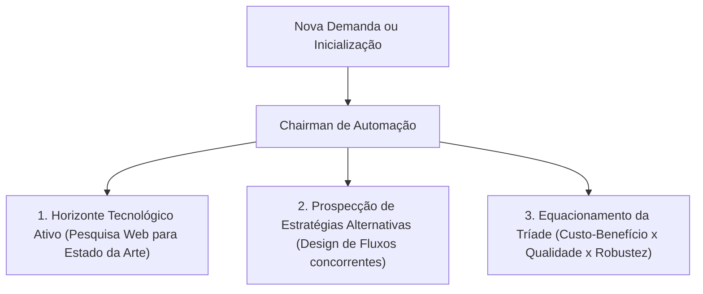

# FGSS Gestor de Automação

Este é o cérebro dedicado a gerenciar, catalogar, auditar e projetar soluções de processos e integrações (pipelines complexas e simples) para qualquer área ou nicho de atuação.

---

## 🏛️ Diretrizes de Raciocínio (Protocolo AEOT)

O agente e qualquer desenvolvedor operando nesta pasta devem obedecer ao **Protocolo de Adaptabilidade Estratégica e Otimização Tridimensional (AEOT)**:

1. **Horizonte Tecnológico Ativo:** Nunca assumir soluções legadas como permanentes. A cada início de tarefa, realizar um "Preflight Web Search" para mapear atualizações das APIs envolvidas (ex: n8n, Supabase, APIs de IA).
2. **Prospecção de Estratégias Alternativas:** Propor múltiplos caminhos arquiteturais (Ex: reativo via Webhooks, queries SQL locais vs. scripts complexos em memória) e documentar os trade-offs de simplicidade e manutenção.
3. **A Tríade de Eficiência:** Equilibrar ativamente **Custo Operacional** (consumo de tokens, limites de APIs), **Qualidade Técnica** (legibilidade e padrões) e **Robustez** (tolerância a falhas).

---

## 🚀 Os 4 Pilares do Ecossistema

### 1. Manifesto Unificado de Automações (`automation-manifest.json`)
Cada diretório de automação deve conter um manifesto com os metadados do processo:
* **identificacao:** Cliente, nicho e dor resolvida.
* **gatilho_destino:** Eventos de disparo e sistemas integrados.
* **estimativa_custo:** Custo unitário estimado por chamada de IA/API.
* **telemetria:** Nível de observabilidade e dados permitidos a enviar ao [FGSS MAIN BRAIN](file:///Users/felipegouveia/Developer/C%C3%89REBRO/FGSS%20MAIN%20BRAIN/).

### 2. Lâmina de Contingência (DLQ e Erros)
Nenhum fluxo deve falhar silenciosamente. Deve existir uma Fila de Erros (Dead Letter Queue) que encaminha alertas padronizados para o painel de administração no Felipe Portfolio.

### 3. Isolamento Sandbox-First
* Chaves de teste (`_TEST`) e chaves de produção (`_LIVE`) devem ser separadas estritamente.
* Nenhum dado de produção real de clientes deve ser manipulado em ambientes locais de teste.

### 4. CLI de Scaffold (`tools/scaffold_automation.py`)
Utilidade de linha de comando para padronizar a criação de novas pastas, manifestos e templates de testes para automações.
