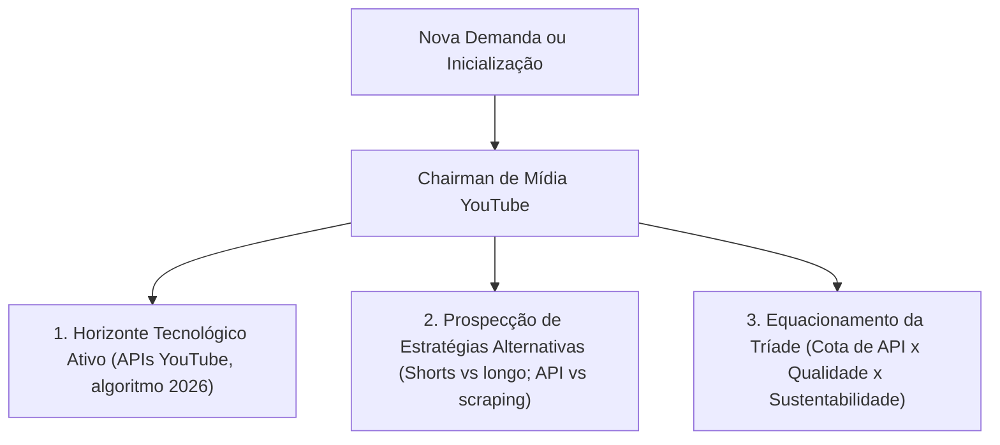

# FGSS Gestor de Mídia YouTube

Este é o cérebro dedicado a gerenciar, catalogar, auditar e projetar soluções de mídia e operação de canais YouTube — SEO, conteúdo, analytics, automação de uploads, Shorts, thumbnails, legendas, growth e risco (Content ID, demonetização).

Engine **irmã** do `FGSS Gestor de Automacao`, sob o ecossistema [CÉREBRO](file:///Users/felipegouveia/Developer/C%C3%89REBRO/).

---

## 🏛️ Diretrizes de Raciocínio (Protocolo AEOT)

O agente e qualquer desenvolvedor operando nesta pasta devem obedecer ao **Protocolo de Adaptabilidade Estratégica e Otimização Tridimensional (AEOT)**:



1. **Horizonte Tecnológico Ativo:** Nunca assumir que as regras do YouTube são fixas. A cada início de tarefa, realizar um "Preflight Web Search" sobre YouTube Data API v3, Analytics API, políticas de Shorts, algoritmo de recomendação e mudanças de monetização do ano corrente.
2. **Prospecção de Estratégias Alternativas:** Propor múltiplos caminhos (ex: upload via API vs. agendamento manual; Shorts diário vs. vídeo longo semanal; legendas auto vs. tradução humana) e documentar trade-offs de quota, alcance e esforço.
3. **A Tríade de Eficiência:** Equilibrar **Custo Operacional** (quota da API, tokens IA para títulos/thumbnails), **Qualidade Técnica** (legibilidade, padrões) e **Robustez** (tolerância a falhas, fallback de upload, DLQ).

---

## 🚀 Os 4 Pilares do Ecossistema

### 1. Manifesto Unificado de Automações YouTube (`automation-manifest.json`)
Cada diretório de automação deve conter um manifesto com os metadados do processo:
* **identificacao:** Canal, nicho e dor resolvida.
* **gatilho_destino:** Eventos de disparo (cron de upload, webhook de novo vídeo, alerta de analytics) e sistemas integrados (YouTube Data API, Analytics API, n8n).
* **estimativa_custo:** Custo unitário estimado por chamada de IA/API (quota points, tokens LLM).
* **telemetria:** Nível de observabilidade e dados permitidos a enviar ao [FGSS MAIN BRAIN](file:///Users/felipegouveia/Developer/C%C3%89REBRO/FGSS%20MAIN%20BRAIN/).

### 2. Lâmina de Contingência (DLQ e Erros)
Nenhum fluxo deve falhar silenciosamente. Deve existir uma Fila de Erros (Dead Letter Queue) que encaminha alertas padronizados para o painel de administração no Felipe Portfolio. Falhas de quota (403), Content ID e upload interrompido devem ir para a DLQ dual (Redis + JSONL).

### 3. Isolamento Sandbox-First
* Chaves de teste (`_TEST`) e chaves de produção (`_LIVE`) devem ser separadas estritamente.
* Nenhum upload, deleção ou mudança de metadado em canal real deve ser manipulado em ambientes locais de teste. Usar canal secundário ou sandbox do YouTube Studio para testes.

### 4. CLI de Scaffold (`tools/scaffold/scaffold_yt.py`)
Utilidade de linha de comando para padronizar a criação de novas automações YouTube (manifesto, módulos de upload/analytics, DLQ dual, logger LGPD).

---

## 📚 Estrutura de Pastas

```
FGSS Gestor de Midia YouTube/
├── AGENTS.md          # Lei do Chairman de Mídia YouTube
├── README.md          # Este arquivo (AEOT + 4 Pilares)
├── glossario.md       # Dicionário técnico de termos YouTube
├── HANDOFF.md         # Memória de transferência entre sessões
├── progress.md        # Progresso da engine
├── findings.md        # Descobertas técnicas
├── docs/
│   ├── bible/         # Bíblia G-T-M: operação de canal (playbooks)
│   ├── bible_hi/      # Bíblia H-I: técnicas profundas (API, algoritmo, SEO)
│   └── raw_markdown/  # Fontes brutas (cursos, anotações)
├── integrations/      # Automações concretas (aut-yt-*)
├── schemas/           # automation-manifest-schema.json
└── tools/
    ├── scaffold/      # CLI de geração de automações
    └── validation/    # Validadores de manifesto
```

---

## 🚧 Estado atual

Engine recém-criada. Estrutura e lei (`AGENTS.md`, `README.md`) prontas. As Bíblias (`docs/bible/`, `docs/bible_hi/`) estão vazias — aguardando ingestão de conhecimento. O `glossario.md` tem semente de termos YouTube.
